# PocketStore

Práctica de una **Progressive Web App (PWA)** sencilla que muestra un catálogo de productos consumido desde una API pública y que sigue funcionando **sin conexión** gracias a un *Service Worker* con estrategia de caché.

- **Autor:** Guillermo Martinez Delgadillo
- **Grupo:** IDGS101N
- **Repositorio:** https://github.com/CrazyBread7364/Proyecto-PocketStore

---

## Tabla de contenido

1. [Descripción general](#descripción-general)
2. [Características](#características)
3. [Tecnologías](#tecnologías)
4. [Estructura del proyecto](#estructura-del-proyecto)
5. [Cómo ejecutarlo](#cómo-ejecutarlo)
6. [Documentación de cada archivo](#documentación-de-cada-archivo)
   - [index.html](#indexhtml)
   - [style.css](#stylecss)
   - [app.js](#appjs)
   - [manifest.json](#manifestjson)
   - [sw.js (Service Worker)](#swjs-service-worker)
7. [Flujo de funcionamiento](#flujo-de-funcionamiento)
8. [Cómo probar el modo offline](#cómo-probar-el-modo-offline)
9. [Flujo de trabajo con Git](#flujo-de-trabajo-con-git)
10. [Evidencias](#evidencias)
11. [Limitaciones conocidas y mejoras](#limitaciones-conocidas-y-mejoras)

---

## Descripción general

PocketStore es una página estática (HTML + CSS + JavaScript sin frameworks ni dependencias) que:

1. Carga una lista de elementos desde la API pública [JSONPlaceholder](https://jsonplaceholder.typicode.com/posts) y los presenta como tarjetas de producto.
2. Registra un **Service Worker** que guarda en caché el *app shell* (los archivos necesarios para pintar la interfaz) y las respuestas que va recibiendo.
3. Declara un **Web App Manifest** para poder instalarse en el dispositivo como una aplicación independiente (`display: standalone`).

El objetivo didáctico es entender el ciclo de vida del Service Worker (`install`, `activate`, `fetch`) y cómo la caché permite una experiencia offline.

## Características

- Interfaz responsiva de una sola columna (ancho máximo de 600 px).
- Consumo de API REST con `fetch`.
- Estado de carga («Cargando datos...») mientras llega la respuesta.
- Caché del *app shell* en la instalación del Service Worker.
- Estrategia **Cache First** con respaldo a la red y guardado dinámico de nuevas respuestas.
- Limpieza automática de cachés de versiones anteriores.
- Instalable como PWA (manifest + íconos).

## Tecnologías

| Tecnología | Uso |
|---|---|
| HTML5 | Estructura de la página |
| CSS3 (Flexbox) | Estilos y *layout* |
| JavaScript (ES6+) | Lógica de la aplicación (`fetch`, template strings, `async` por promesas) |
| Service Worker API + Cache API | Funcionamiento offline |
| Web App Manifest | Instalación como PWA |
| JSONPlaceholder | API REST de prueba |
| Git / GitHub | Control de versiones con Pull Requests |

## Estructura del proyecto

```
Proyecto-PocketStore/
├── README.md                  # Descripción corta del repositorio
└── proyectoPocketSt/
    ├── index.html             # Página principal
    ├── style.css              # Estilos
    ├── app.js                 # Lógica: consumo de la API y render de tarjetas
    ├── sw.js                  # Service Worker (caché y offline)
    ├── manifest.json          # Manifiesto de la PWA
    ├── images/
    │   └── icons/
    │       ├── icono1.png     # Favicon e ícono de la PWA
    │       └── icono2.png     # Logo del encabezado e ícono de la PWA
    ├── docs/                  # Capturas de pantalla de evidencia
    └── README.md              # Este documento
```

## Cómo ejecutarlo

Los Service Workers **no funcionan abriendo el archivo con `file://`**; requieren servirse por HTTP(S). `localhost` se considera un origen seguro, por lo que basta con un servidor local.

1. Clona el repositorio:

   ```bash
   git clone https://github.com/CrazyBread7364/Proyecto-PocketStore.git
   cd Proyecto-PocketStore/proyectoPocketSt
   ```

2. Levanta un servidor estático con cualquiera de estas opciones:

   ```bash
   # Python 3
   python -m http.server 8080

   # Node.js
   npx serve .

   # VS Code: extensión "Live Server" → clic derecho en index.html → Open with Live Server
   ```

3. Abre `http://localhost:8080` en el navegador (se recomienda Chrome o Edge).

> No se requiere `npm install` ni ningún paso de *build*.

---

## Documentación de cada archivo

### index.html

Define la estructura semántica de la página:

| Elemento | Descripción |
|---|---|
| `<head>` | Codificación UTF-8, *viewport* responsivo, enlaces a `style.css` y `manifest.json`, favicon (`icono1.png`) y `theme-color`. |
| `<header class="header">` | Logo (`icono2.png`) y título **PocketStore**. |
| `<main class="main">` | Mensaje de bienvenida y el contenedor `#app-container`, que inicia con «Cargando datos...» y es reemplazado por las tarjetas. |
| `<footer class="footer">` | Datos del autor, grupo y fecha. |
| `<script src="app.js">` | Carga la lógica de la aplicación. |
| Script en línea | Registra el Service Worker si el navegador lo soporta: `navigator.serviceWorker.register('./sw.js')`. |

### style.css

| Selector | Función |
|---|---|
| `*` | *Reset* de márgenes y rellenos, `box-sizing: border-box` y fuente Arial. |
| `body` | Fondo gris claro; `display: flex` en columna con `min-height: 100vh` para que el pie de página quede siempre al final. |
| `.header` | Barra azul (`#007bff`), texto blanco y centrado. |
| `.logo` | Logo de 48×48 px alineado con el título. |
| `.main` | Ocupa el espacio restante (`flex: 1`), ancho máximo de 600 px y centrado. |
| `.product-card` | Tarjeta blanca con borde, esquinas redondeadas y separación superior. Su `h3` se muestra capitalizado y su `p` en gris. |
| `.footer` | Barra oscura (`#222`) con texto pequeño, empujada al fondo con `margin-top: auto`. |

### app.js

Lógica del catálogo, en cuatro pasos:

1. **Obtiene el contenedor** `#app-container`.
2. **Pide los datos** con `fetch('https://jsonplaceholder.typicode.com/posts')` y los convierte con `response.json()`.
3. **Selecciona los primeros 5 elementos** con `data.slice(0, 5)`.
4. **Renderiza**: vacía el contenedor (elimina «Cargando datos...») y agrega por cada elemento un `<article class="product-card">` con `title` en un `<h3>` y `body` en un `<p>`.

Si la petición falla, el error se registra en consola (`console.error`).

Correspondencia de los campos de la API con la interfaz:

| Campo de JSONPlaceholder | Se muestra como |
|---|---|
| `title` | Nombre del «producto» (`<h3>`) |
| `body` | Descripción del «producto» (`<p>`) |

### manifest.json

| Propiedad | Valor | Significado |
|---|---|---|
| `name` | `PocketStore - Catalog_Offline` | Nombre completo de la app |
| `short_name` | `PocketStore` | Nombre bajo el ícono en la pantalla de inicio |
| `description` | `PocketStore - Catalog_Offline` | Descripción |
| `start_url` | `./` | Página con la que arranca la app instalada |
| `display` | `standalone` | Se abre sin la interfaz del navegador |
| `background_color` | `#ffffff` | Color de la pantalla de inicio (*splash*) |
| `theme_color` | `#000000` | Color de la barra de la app |
| `icons` | `icono1.png`, `icono2.png` (512×512) | Íconos de instalación |

### sw.js (Service Worker)

**Constantes**

- `CACHE_NAME = 'pocketstore-v3'`: nombre y versión de la caché. Al cambiarlo se invalidan los datos anteriores.
- `urlsToCache`: el *app shell* que se precachea — `./`, `index.html`, `style.css`, `app.js`, `manifest.json` y los dos íconos.

**Eventos**

| Evento | Qué hace |
|---|---|
| `install` | Abre la caché `pocketstore-v3`, guarda todo el *app shell* con `cache.addAll()` y llama a `skipWaiting()` para activarse de inmediato sin esperar a que se cierren las pestañas antiguas. |
| `activate` | Recorre todas las cachés existentes y **elimina las que no coincidan** con `CACHE_NAME`; después ejecuta `clients.claim()` para tomar control de las páginas abiertas. |
| `fetch` | Aplica la estrategia **Cache First** (ver más abajo). |

**Estrategia de `fetch` (Cache First con guardado dinámico)**

```
Petición ─▶ ¿está en caché? ──sí──▶ responder desde caché
                │
                no
                ▼
          pedir a la red
                │
                ▼
   ¿status 200 y tipo basic/cors? ──no──▶ devolver la respuesta sin guardar
                │
               sí
                ▼
   clonar respuesta ─▶ guardar en caché ─▶ devolver la respuesta
```

Como la petición a JSONPlaceholder es una respuesta `cors` con estado 200, **también se guarda en caché**, y por eso el catálogo se puede ver sin conexión después de la primera carga.

---

## Flujo de funcionamiento

1. El navegador carga `index.html`, `style.css` y `app.js`.
2. El script en línea registra `sw.js`.
3. `app.js` hace `fetch` a la API; el Service Worker intercepta la petición y la guarda en caché al recibir la respuesta.
4. Se pintan 5 tarjetas en `#app-container`.
5. En visitas posteriores (incluso offline), el Service Worker responde desde la caché y la app sigue mostrando el catálogo.

## Cómo probar el modo offline

1. Abre la app en `http://localhost:8080` con la conexión activa y deja que cargue el catálogo.
2. Abre las **DevTools** (F12) → pestaña **Application**:
   - **Service Workers**: verifica que `sw.js` esté *activated and running*.
   - **Cache Storage → `pocketstore-v3`**: verifica que estén los archivos del *app shell* y la respuesta de la API.
3. En **Service Workers** marca la casilla **Offline** (o desactiva la red en la pestaña *Network*).
4. Recarga la página: la interfaz y las tarjetas deben seguir apareciendo.
5. Para probar la actualización de versión, cambia `CACHE_NAME` (por ejemplo a `pocketstore-v4`), recarga y comprueba en *Cache Storage* que la caché anterior fue eliminada.

## Flujo de trabajo con Git

El proyecto se desarrolló con ramas por funcionalidad y *Pull Requests* hacia `main`:

| PR | Rama | Contenido |
|---|---|---|
| #1 | `feat/index` | Página principal y estilos |
| #2 | `feat/app_logic` | Service Worker y lógica de consumo de la API |
| #3 | `feat/manifest` | `manifest.json` e íconos |
| #4 | `docs` | Capturas de evidencia |

## Evidencias

Capturas del desarrollo, guardadas en la carpeta [docs/](docs/).

### Repositorio y estructura

| Captura | Archivo |
|---|---|
| Creación del repositorio |  |
| Primer commit |  |
| Archivos del proyecto | 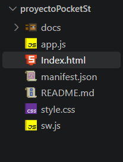 |

### Página y estilos

| Captura | Archivo |
|---|---|
| Creación del index | 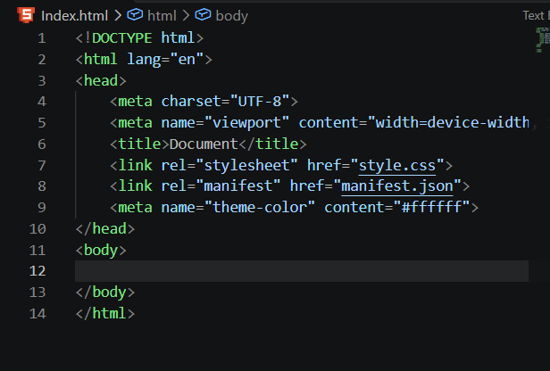 |
| Estructura del index | 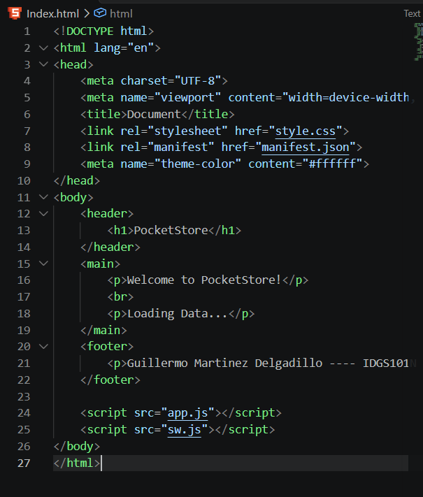 |
| Index completo | 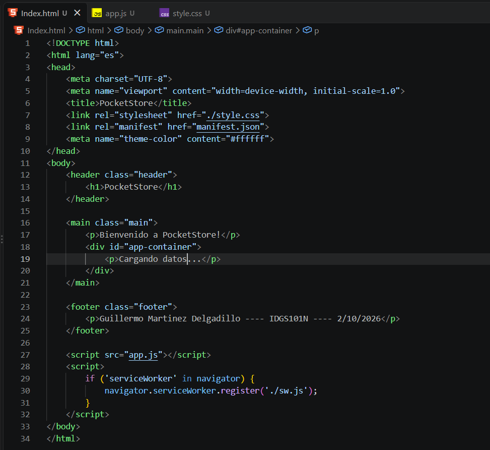 |
| Estilos (1) | 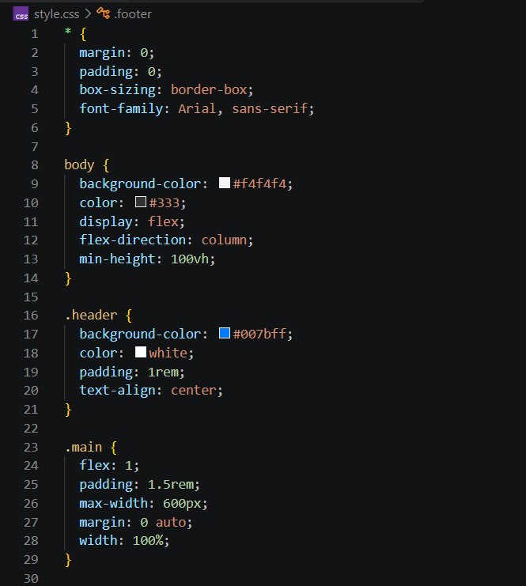 |
| Estilos (2) | 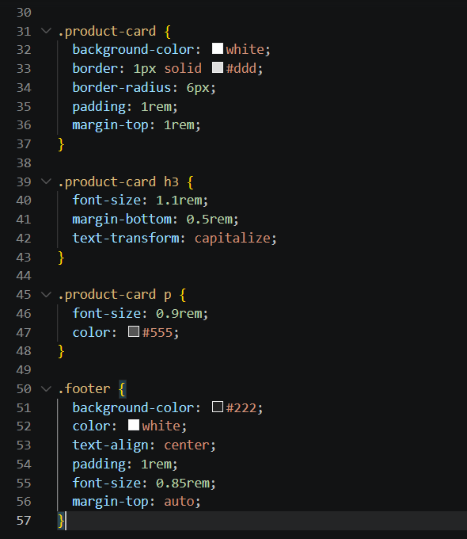 |
| Vista HTML completa | 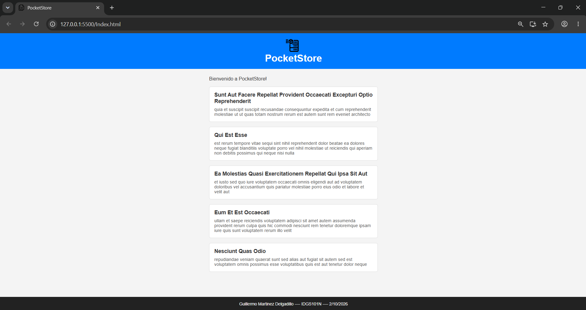 |

### Lógica y consumo de la API

| Captura | Archivo |
|---|---|
| `app.js` | 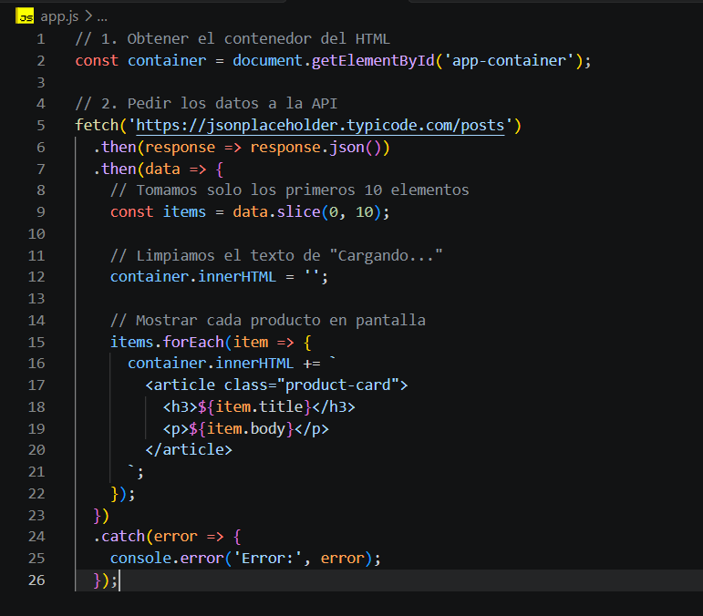 |
| Lógica de la API en `app.js` | 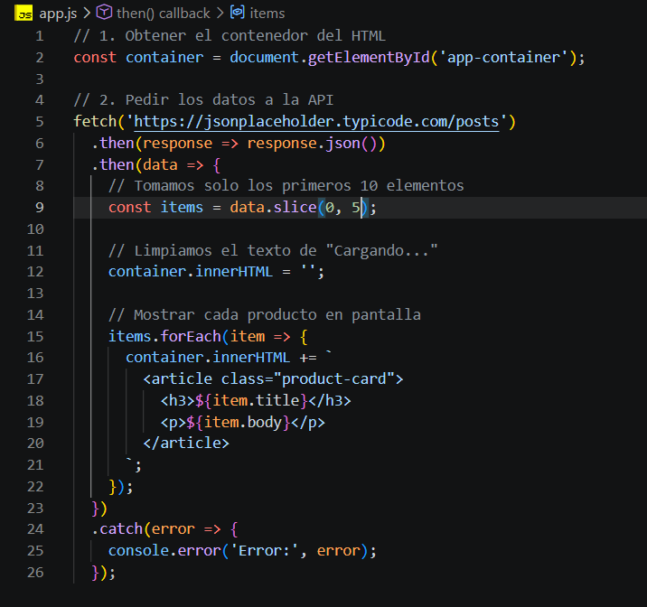 |
| Vista con datos cargados | 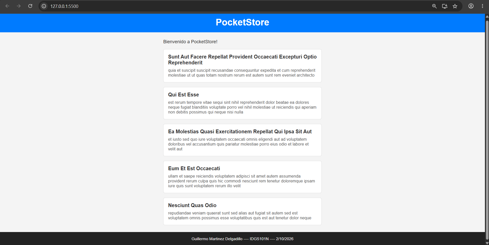 |

### Service Worker y caché

| Captura | Archivo |
|---|---|
| Caché en `sw.js` | 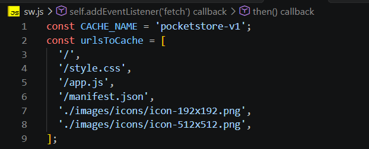 |
| Evento `install` | 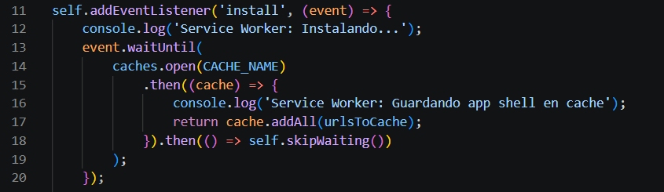 |
| Evento `activate` | 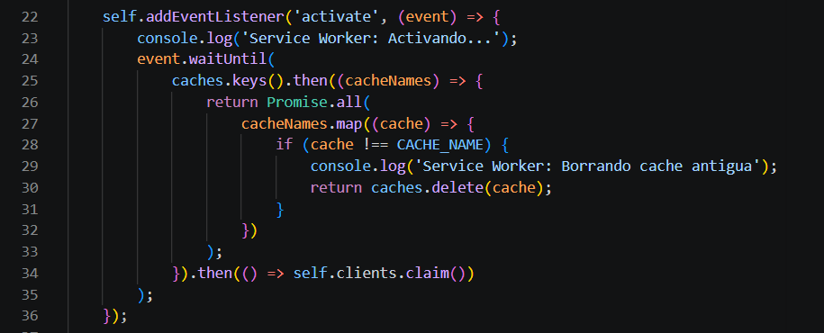 |
| Evento `fetch` | 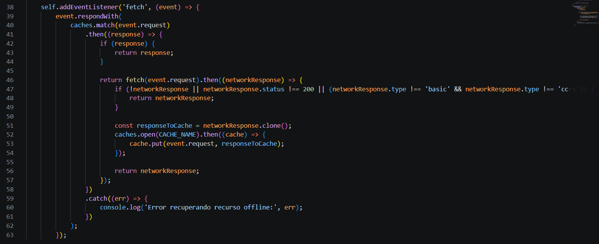 |
| Caché guardada en el navegador | 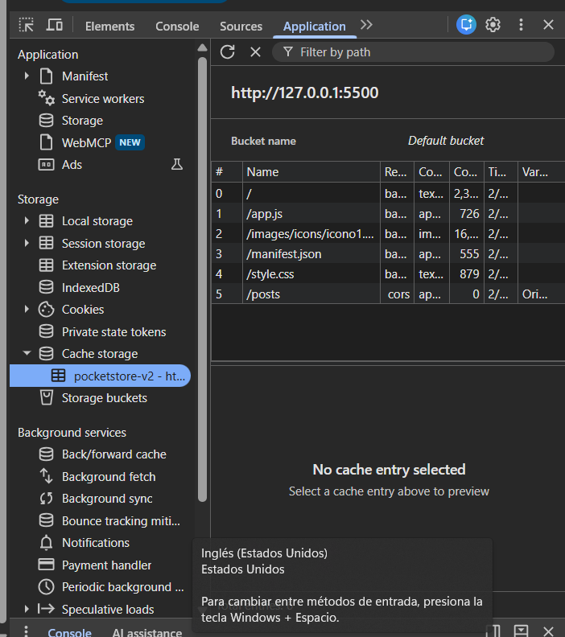 |

## Limitaciones conocidas y mejoras

Observaciones sobre el código actual, útiles como siguientes pasos:

- **Datos obsoletos:** con *Cache First*, la respuesta de la API se guarda una vez y ya no se actualiza mientras exista en la caché. Una mejora es usar *Stale-While-Revalidate* o *Network First* para las peticiones a la API.
- **Sin respaldo offline:** si un recurso no está en caché y no hay red, el `catch` del Service Worker solo escribe en consola y no devuelve una respuesta alternativa (podría servirse `index.html` u otra página offline).
- **Comentario desactualizado en `app.js`:** el comentario dice «primeros 10 elementos», pero el código usa `slice(0, 5)` (5 elementos).
- **Colores inconsistentes:** `theme-color` en `index.html` es `#ffffff`, mientras que en `manifest.json` es `#000000`, y el encabezado usa `#007bff`.
- **Íconos:** ambos están declarados como 512×512; conviene incluir tamaños adicionales (192×192) y un ícono `maskable` para una mejor instalación.
- **Seguridad al renderizar:** `innerHTML +=` con datos externos podría permitir inyección de HTML si la fuente no es confiable; es preferible usar `textContent` o `createElement`. Además, reasignar `innerHTML` en cada iteración es ineficiente.
- **Manejo de errores en la UI:** si falla el `fetch`, el usuario sigue viendo «Cargando datos...»; debería mostrarse un mensaje de error.
- **Versionado de caché manual:** hay que recordar cambiar `CACHE_NAME` cada vez que se modifican los archivos del *app shell*.
End